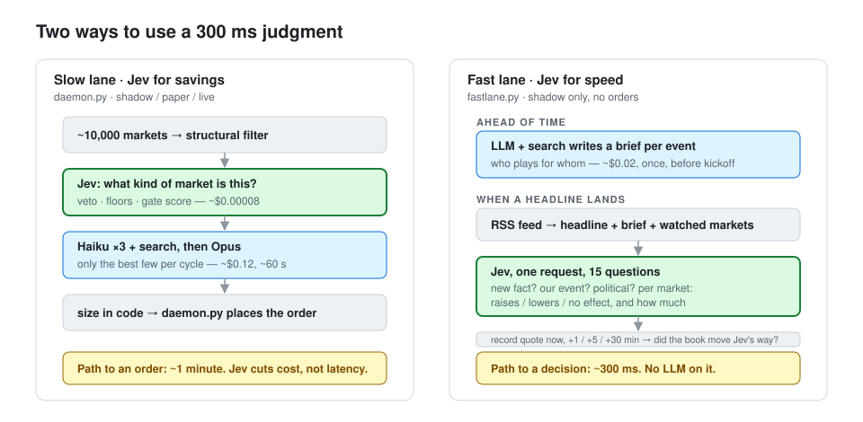
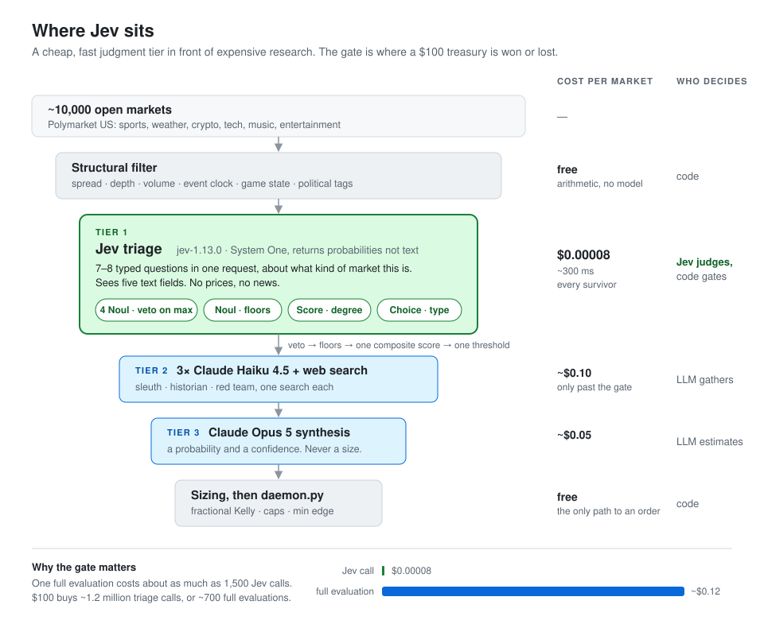

# swarm

An autonomous trading pipeline for [Polymarket US](https://polymarket.us),
built to answer one question: **what is a System One model good for inside
a real decision system?**

The model is [Jev](https://docs.typesafe.ai) from TypeSafe. It does not
generate text. It takes a JSON state and a set of typed questions and returns
probabilities your code branches on, in about 300 ms, for about $0.00008 a
call. This repo puts it where that profile matters most: in front of
expensive LLM research, deciding which of ~10,000 open markets deserve any
money spent on them at all.

The treasury is $100. That is deliberate. At that size every wasted research
call is visible, so the value of the cheap tier is measurable.

There are two lanes, because a 300 ms judgment is useful in two different
ways:

| lane | Jev is used for | path to a decision | status |
| --- | --- | --- | --- |
| **Slow lane** ([daemon.py](daemon.py)) | **savings**: filter ~10,000 markets before any LLM spend | ~1 minute (LLM research) | shadow, paper; live gated |
| **Fast lane** ([fastlane.py](fastlane.py)) | **speed**: read a headline against an LLM-written brief | ~300 ms, no LLM on the path | shadow only, records price drift |



**Status: infrastructure is well tested; edge is not demonstrated.** Four
real orders have been placed, all tiny and manual: one to prove the round
trip (won), three on a fast-lane signal (all lost, -$3.99). Everything else
has run in shadow or paper mode. See
[What we have measured](#what-we-have-measured) before drawing conclusions.

## Slow lane: the shape



The economic argument is the ratio between tiers. A full evaluation costs
roughly 1,500x a Jev call. $100 buys about 1.2 million triage calls or about
700 full evaluations, so the gate is where the budget is won or lost.

## How Jev is used in the slow lane

All of it lives in [questions.py](questions.py). That file is the experiment;
the rest is plumbing.

### 1. One request, several independent judgments

Jev reads the state once and answers every question against it in parallel,
and output tokens are free. So triage asks everything it might need in a
single call rather than chaining calls:

| question | primitive | what it decides |
| --- | --- | --- |
| `federal_policy_outcome` | Noul | restricted-domain veto |
| `defense_or_military` | Noul | restricted-domain veto |
| `us_election_or_appointment` | Noul | restricted-domain veto |
| `politics_or_government` | Noul | restricted-domain veto |
| `objective_resolution` | Noul | can two readers agree how this resolves? |
| `self_contained` | Noul | general markets only |
| `research_would_help` | Score (3 levels) | general markets only |
| `outcome_type` | Choice | general: what process generates the result |
| `stat_aggregation` | Score (3 levels) | sports: one play, or many? |
| `pregame_information_edge` | Score (3 levels) | sports |
| `sports_market_type` | Choice | sports |

Which tractability block is asked is a tag lookup in code, not a question.

### 2. The three primitives, used for what each one means

- **Noul** is P(yes) for a condition. It carries no confidence field, and a
  value near 0.5 means "unsure", not "medium". We use Nouls for vetoes and
  floors.
- **Score** is a probability-weighted position on ordered levels that we
  write. Its `confidence` is how concentrated the distribution is.
- **Choice** picks one of a defined set and returns the full distribution.

### 3. Code owns everything deterministic

Spread, depth, volume, time to event, game state and tag membership are
arithmetic or string comparison, so they run in `structural_filter()` before
Jev is called and are never sent to it. The state Jev sees is five fields:
`question`, `outcome`, `event`, `description`, `tags`. No prices, no news.
Tier 1 judges what *kind* of market this is, never who will win. Asking a
model about things it cannot see gets an answer from its weights.

### 4. A hard veto on the max

The operator does not trade politics, government policy, or defense, in any
country. Two layers enforce it: `political_tag()` in code, then four Nouls
with a veto if the **max** exceeds 0.12. Max, not mean: they are alternative
routes to the same problem, and averaging would let one loud signal be
drowned by three quiet ones.

Measured on `jev-1.13.0` with 17 labelled markets
([tools/probe_restricted.py](tools/probe_restricted.py)): political markets
scored 0.95-0.99, everything else at or below 0.05, including the awkward
cases (Commanders vs Patriots sacks; NFL Defensive Player of the Year). The
probe also found a real hole: three US-scoped questions scored a UK election
at 0.02. Re-run it after any edit to veto wording. It costs a tenth of a cent.

### 5. A composite gate, in code

Floors first, then one weighted mean of the tractability answers minus a
penalty keyed on the Choice, against one threshold. Weights and thresholds
live in `GateThresholds` and can be re-swept over stored answers for free
(`shadow.py --sweep`), because re-weighting does not need re-asking.

### 6. Pinned model, strict parsing

`jev-latest`, `jev-preview` and `jev-1.13` all float. Live mode refuses any id
that is not `jev-N.N.N`, since a model update silently recalibrates every
threshold. Answers are parsed strictly: a missing or malformed answer raises
rather than defaulting to 0.0, because on a veto question 0.0 means "allowed".

## Fast lane: Jev for speed

The slow lane uses Jev to save money. A 300 ms judgment followed by a
minute of LLM research is still a slow pipeline, so
[fastlane.py](fastlane.py) inverts it:

- **Ahead of time, slow:** an LLM with web search writes a *brief* per event
  (who plays for which team).
- **At the moment of news, fast:** a headline arrives from an RSS feed and
  ONE Jev request answers, against the brief, whether it is a new fact,
  whether it concerns the event, and for each watched market which way it
  pushes YES and how much. Median 180-350 ms for 15 questions. No LLM on
  the path.

It places no orders. It records the quote at the moment of the headline and
again at +1, +5 and +30 minutes, so the question is not "did the bet win"
(days) but "did the price move the way Jev said" (minutes). It also records
feed lag, because if RSS runs minutes behind the book no model speed helps.

Why the brief matters, measured with
[tools/probe_fastlane.py](tools/probe_fastlane.py): for the headline
"inactives: Puka Nacua ruled out", which names no team, Jev without a brief
said it *raises* the Rams' chance of covering. Nacua is a Ram. With the brief
it stays out of that market and correctly lowers the Rams' team total. Jev
reads what it is given; it does not know rosters.

```bash
python fastlane.py --tags nfl --start-window 6 --minutes 240   # watch one slate
python fastlane.py --score                                     # drift after each signal
python tools/probe_fastlane.py                                 # direction on labelled headlines
```

What decides whether this lane ever trades: feed lag (if RSS runs minutes
behind the book, no model speed helps), signed drift after a signal beating
the spread and the control, and dozens of acted headlines across several
days. Until then it is a measurement, and it stays shadow-only.

## What we have learned about Jev

Working notes, from running it rather than reading about it.

**It earns its place as a filter.** ~300 ms and ~$0.00008 per market means
triage is never the bottleneck; exchange rate limits are (about one quote per
1.2 s). We stopped optimizing Tier 1 cost entirely.

**It is repeatable.** The same market triaged twice moved a Noul by 0.02 on
average. Thresholds more than ~0.05 from where answers cluster are stable.

**It reads literally.** "Answers the question you wrote, not the one you
meant" is accurate. A Score signal reading "exact margin" swept up point
spreads, which are thresholds, not exact margins, and vetoed 33 of 40 game
result markets. A veto question that inspected `question` but not `outcome`
could not see "Secretary of Defense" sitting in the outcome leg.

**Question design is the whole job, and it is hard.** Of the sports block's
three signals, two are near-constant on real data (sd 0.10 on a 0-2 scale;
sd 0.02 on a 0-1 scale). A question that does not vary is a constant with a
weight on it. [PROPOSALS.md](docs/PROPOSALS.md) has the audit and proposed rewrites.

**Bugs here are silent.** The recurring failure in this repo is a plausible
0.0: three ANDed thresholds whose joint pass rate was zero, factors multiplied
against a fixed threshold, a share floor compared to a level count. Each
looked like "the model said no". [CLAUDE.md](CLAUDE.md) documents them.

**It is not a forecaster, and we do not use it as one.** Jev's calibration is
about the question asked. A Noul of 0.90 on `objective_resolution` is a claim
about the market's wording, not about the bet.

## What we have measured

Be careful with all of it.

- 830 triage verdicts across ten categories; 399 resolved with a quote,
  from **21 events on two NFL days** (Sunday and Monday, 2026-09-20/21).
  No non-sports market has resolved yet.
- Escalated and resolved: 65 markets. The raw Brier comparison between
  escalated and rejected markets is confounded by price level and is no
  longer printed as a conclusion; `--score` now compares signed residuals
  within price bands.
- Favourites priced 0.92-0.96 won 91% (225 markets, 15 events); those
  priced above 0.96 won 88% (24 markets, 12 events). Two days of one sport.
  A hypothesis, not a finding.
- Markets inside one event resolve together, so **the sample size is events,
  not markets**, and days, not events, when one slate shares a shock. A claim
  about strategy return needs roughly 100+ events over 10+ days.

**Categories beyond NFL (smoke tests, 2026-09-22):**

- MLB: five games, briefs with concrete triggers, headline routing clean
  (a roster move scored 0.95 for its game and 0.03-0.05 for the others).
- Tech and crypto: briefs with scenarios and fair prices for standing
  markets. Most crypto headlines are regulatory and scored ~0.9 political,
  so the veto removes them. A sports-worded `concerns_event` scored Bitcoin
  news at 0.43 for a Bitcoin market; reworded, 0.95
  ([tools/probe_concerns.py](tools/probe_concerns.py)).
- Weather: the LLM tiers returned the market's own price on every market
  ($0.20), because nobody read the forecast. [weather.py](weather.py) now
  compares the NWS forecast-implied band probability to the price, in code.
  First day: SF tomorrow matched within 0.07 on every band; NYC "67-68"
  was priced 0.50 vs 0.31 implied; Miami "88-89" 0.39 vs 0.19. Outcomes
  arrive daily, so this is the fastest calibration data the project has.

**Fast lane, first live game (Giants-Rams, 2026-09-21):**

- 24 headlines judged, median Jev decision 412 ms for 15 questions.
- Feed lag: median 15.6 min, fastest 1.9 min. The first headline on the
  Giants' QB injury arrived 115 s after publication and Jev flagged it
  correctly. The full-game spread then moved 0.53 -> 0.37 in the direction
  Jev gave. That is one headline, one game: a reason to keep measuring, not
  a finding.
- The three period markets nearest 0.50 did not move a tick in 30 minutes
  after any headline. Thin derivative books do not reprice on news; the
  watchlist now takes full-game lines first.
- Eight headlines on one injury each re-flagged the same markets. A
  `repeats_acted_fact` Noul now recognises rewrites (0.88-0.93) against
  genuinely new items (0.02-0.07); [tools/probe_dedup.py](tools/probe_dedup.py).
- Three manual 3-share orders were placed on the fifth repeat, 17 minutes
  after the first signal, because the operator-side log watch was buffering.
  All three lost. Acting late on a fact the book has priced is the failure
  mode the lag number predicts.
- In aggregate, acted rows drifted no more than the control. Eight headlines
  from one game say nothing either way.

What the project can honestly claim today: the cheap tier works as a filter,
the veto separates cleanly, the fast path works end to end at ~400 ms, and
the plumbing is sound. Whether either lane finds prices that lag information
is the open question.

## Layout

| file | what it is |
| --- | --- |
| [questions.py](questions.py) | **The experiment.** Every Jev question, threshold and structural limit, for both lanes. |
| **Slow lane** | |
| [swarm.py](swarm.py) | Jev client, gate, gatherers, synthesis, sizing, per-event exposure cap. |
| [adapters.py](adapters.py) | Normalizes `polymarket_us` wire shapes. Do not bypass. |
| [schemas.py](schemas.py) | Pydantic contracts between tiers. |
| [shadow.py](shadow.py) | Triage-only collector, settlement backfill, scoring, calibration. **Start here.** |
| [daemon.py](daemon.py) | Entry point. Triages everything, researches the best few. The only place an order can be created. |
| [risk_engine.py](risk_engine.py) | NLV, cost ledger, kill switch. |
| [search.py](search.py) | Web search for Tier 2 (Anthropic server tool). |
| [traces.py](traces.py) | What Tiers 2/3 believed, with `--backfill` and `--score` against the price they saw. |
| **Fast lane** | |
| [fastlane.py](fastlane.py) | **Shadow-only.** Jev reads headlines in ~300 ms against an LLM-written brief; prices are followed for 30 min. |
| [weather.py](weather.py) | **Shadow-only, code only.** NWS forecast-implied probability vs the market, daily. No model: weather is arithmetic. |
| **Shared** | |
| [inplay.py](inplay.py) | Websocket feed and in-game experiments. |
| [config.py](config.py) | Env loading, fail-fast validation. |
| [dashboard/ledger.html](dashboard/ledger.html) | The shared results page (real and paper bets, Jev on the news, calibration, weather). Hosted on claude.ai; data pushed from `tools/dashboard_export.py`. |
| [tools/](tools/) | `probe_restricted.py`, `probe_fastlane.py`, `probe_dedup.py`, `probe_concerns.py`, `survey_tags.py`, `by_category.py`. |
| [tests/](tests/) | 210 tests. No network, no keys; httpx is mocked at the transport layer. |
| [CLAUDE.md](CLAUDE.md) | Hard rules, wire-format facts, bug history. Read before editing. |
| [docs/BRIEF.md](docs/BRIEF.md) | Design: the brief that gives Jev its information, and the loop that revises it. |
| [docs/PROPOSALS.md](docs/PROPOSALS.md) | Question changes awaiting a human decision. |
| [CONTRIBUTING.md](CONTRIBUTING.md) | Setup, where changes go, and what needs evidence. |

## Setup

```bash
make setup                 # venv, deps, .env from the template
# put your own keys in .env; it is gitignored. Never commit or paste it.
make check                 # ruff + 210 tests, no network, no keys needed
python verify_setup.py     # one live Jev call (~$0.00008) to prove the key
```

Windows without `make`:

```powershell
python -m venv .venv
.venv\Scripts\python.exe -m pip install -r requirements.txt
copy .env.example .env
.venv\Scripts\python.exe -m pytest -q
.venv\Scripts\python.exe verify_setup.py
```

Only `TYPESAFE_API_KEY` is needed for shadow mode. Set
`TYPESAFE_DEFAULT_MODEL=jev-1.13.0`.

## Modes

| mode | Jev | Tier 2/3 | orders | needs |
| --- | --- | --- | --- | --- |
| `shadow` (default) | yes | no | none | TypeSafe key |
| `paper` | yes | yes, real spend | logged, never sent | + Polymarket and Anthropic keys, funded account |
| `live` | yes | yes | **real** | + `I_UNDERSTAND_THIS_TRADES_REAL_MONEY=yes`, pinned model |

There is no make target and no launch config for live mode. It is typed in a
terminal, on purpose, and the two live variables are never written to `.env`.

### Shadow: cents, and where to start

```bash
python shadow.py --collect --limit 200   # triage and store; --limit is markets
python shadow.py --backfill              # fill outcomes; settlement lands in minutes
python shadow.py --analyze               # escalation rate, veto reasons
python shadow.py --sweep gate_score      # re-score stored answers at other thresholds
python shadow.py --score                 # escalated vs rejected, on resolved markets
python shadow.py --calibrate             # price vs frequency, counted by event
python tools/by_category.py 3            # per-category breakdown, last 3 hours
```

Quotes are paced at 2 concurrent, 1.2 s apart. Faster gets Cloudflare-blocked
and returns HTML. A 20 h cooldown stops a market being re-triaged every sweep.

### Paper

```bash
python verify_account.py                 # read-only account check
SWARM_MODE=paper python daemon.py --once --tags nfl --start-window 4 --min-hours 1 \
    --research-per-cycle 5 --research-per-event 1
python traces.py --backfill --score    # after settlement: Tier 3 Brier vs the market's
```

Every market is triaged; only the best few by gate score are researched,
at most one per event by default, since an event's legs resolve together.

An unfunded account reads as NLV $0 and trips the kill switch at startup.
That is the floor working.

## Safety rules

Enforced in code and tests; see [CLAUDE.md](CLAUDE.md) for the full list.

- No order is created outside `daemon.py`.
- No LLM output is ever a dollar amount, share count or Kelly fraction.
- The restricted veto is never widened and never averaged.
- One event holds at most 10% of bankroll, enforced in code after sizing.
- `SWARM_MODE` defaults to `shadow`.
- The kill switch exits 2 and writes `.halted`. Nothing clears it but a human.

| exit code | meaning | a supervisor should |
| --- | --- | --- |
| 0 | clean stop | may restart |
| 2 | kill switch | **not restart** |
| 3 | config problem | not restart |

## Not built yet

- Event-scoped fact cache, so 30 props on one game share one search.
- Scheduled daily collection across categories. This is what produces a
  sample large enough to mean anything.
- Fast-lane order path. Deliberately absent until `fastlane.py --score`
  shows drift that beats the spread over several days.
- A learning loop over resolved markets. Designed, deliberately not built:
  it needs thousands of resolved markets across many days first.

## Contributing

See [CONTRIBUTING.md](CONTRIBUTING.md). The short version: question wording,
thresholds and structural limits are proposals backed by a measurement, and
a test fixture is not evidence about the wire format; a probe against the
live API is.
